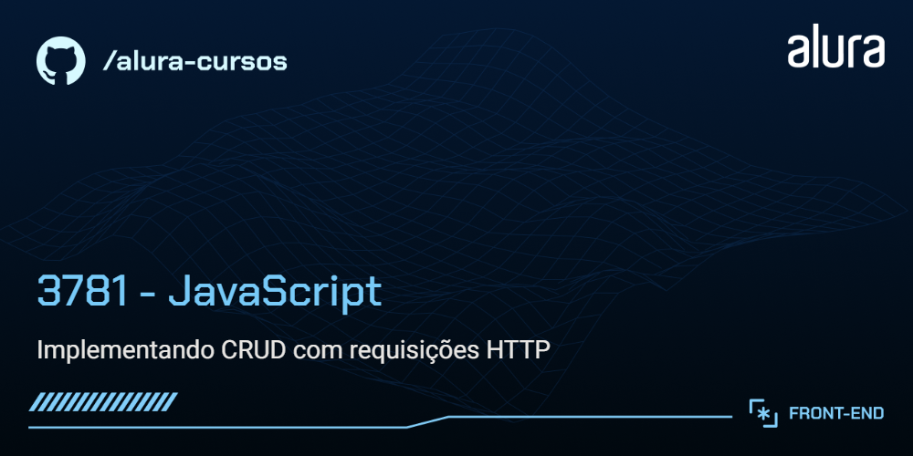

# Adopet

Adopet é um aplicativo organizador de pets para adoção que permite cadastrar, listar, editar e deletar pets felinos, incluindo informações como nome e raça.

## 🔨 Funcionalidades do projeto

`Cadastro de pets`: Permite adicionar novos pets à lista, inserindo informações como nome e raça.

`Listagem de pets`: Exibe os pets cadastrados, permitindo visualizar o nome e a raça.

`Edição de pets`: Permite editar pets existentes, atualizando as informações conforme necessário.

`Exclusão de pets`: Permite remover pets da lista.

## ✔️ Técnicas e tecnologias utilizadas

`JavaScript`: Linguagem de programação utilizada para desenvolver a lógica do aplicativo.

`Fetch API`: Utilizada para realizar requisições HTTP para comunicação com o servidor.

`Axios`: Biblioteca usada para facilitar e simplificar as requisições HTTP.

`Node.js`: Plataforma utilizada para executar o ambiente de desenvolvimento.

`JSON Server`: Utilizado para simular um backend e facilitar o desenvolvimento e teste das operações CRUD.

`CSS`: Utilizado para estilização da interface do aplicativo.

## 🛠️ Abrir e rodar o projeto

Para executar a API fake, você vai precisar do NodeJS; a versão utilizada foi a 20.12.2.

Instale o JSON Server globalmente (se ainda não estiver instalado):

```bash
npm install -g json-server
```

Para executar, abra um novo terminal e, dentro da pasta backend, execute:

```bash
npm start
```

Acesse o backend localmente em seu navegador:

http://localhost:3000

Para executar o frontend, abra o projeto no Visual Studio Code. Com a extensão Live Server instalada, clique com o botão direito no arquivo index.html e selecione "Open with Live Server" no menu de contexto.

Acesse o frontend localmente em seu navegador:

http://localhost:5500
